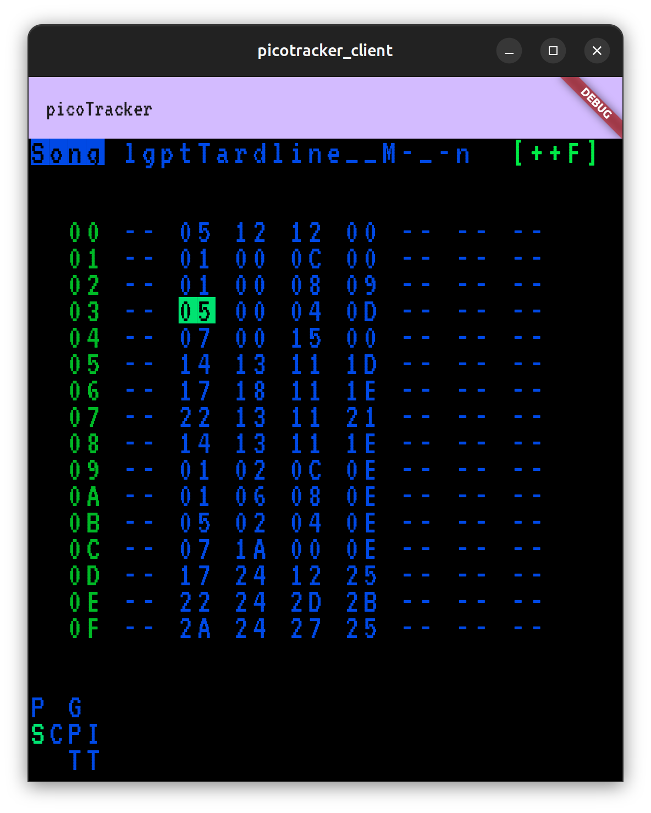

# Picotracker Client

Remote client UI over USB for picoTrackers built with Flutter.

]

## Getting Started

Connect picotracker to usb port. On linux this will probably be `/dev/ttyACM0`
You will need to switch between any 2 screens on the picotracker to "initialise" the display on the app.

## Supported Platforms

- [X] Linux
- [ ] MacOS
- [ ] Web
- [ ] Android
- [ ] Windows

## TODO

- [X] display fg/bg colours
- [ ] send current palette (custom colours) from picotracker to app
- [ ] implement notes blank *background* display of Song screen
- [ ] reconnect port on picotracker reset (on load new project)
- [ ] set initial window size
- [ ] show usb port connection status
- [ ] app setting for USB port device name
- [ ] switch to using a custompainter canvas and bitmap font like: https://github.com/dhepper/font8x8
- [ ] send key events to picotracker 
- [ ] package as app
- [ ] webapp version?