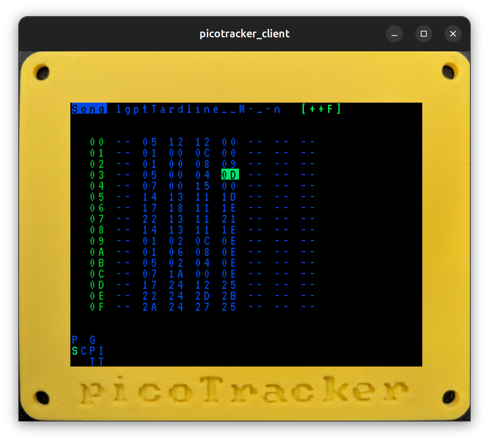

# Picotracker Client

Remote client UI over USB for picoTrackers built with Flutter.

]

The webapp [is available here](https://xiphonics.github.io/picotracker_client/).

## Getting Started

Connect picotracker to usb port. On linux this will probably be `/dev/ttyACM0`
You will need to switch between any 2 screens on the picotracker to "initialise" the display on the app.

## Supported Platforms

- [X] Web
- [X] Linux (for dev/debugging only)

## TODO

- [X] display fg/bg colours
- [X] webapp version
- [ ] use palette (custom colours) send from picotracker ([once supported by remoteui protocol](https://github.com/xiphonics/picoTracker/issues/263))
- [X] implement notes blank *background* display of Song screen
- [ ] reconnect port on picotracker reset (on load new project)
- [ ] set initial window size
- [ ] show usb port connection status
- [X] app setting for USB port device name
- [ ] request refresh on connect ([once supported by remoteui protocol](https://github.com/xiphonics/picoTracker/issues/263))
